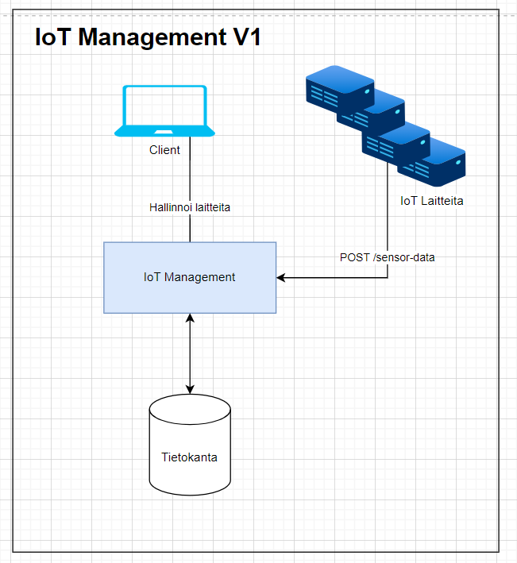
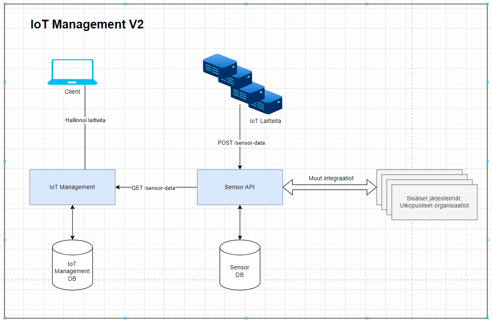

# IoT Management - OOP Tutorial

## Introduction
I created educational material (application and presentation) for [VAMK](https://www.vamk.fi/).
The purpose of this is to show why clean code and architecture is important, and how OOP can be used to achieve that.

Versions:
- [v1](/v1): 
    - Showcasing **bad examples**
    - Framework code, APIs, business logic, database calls all mixed together.
    - Code is difficult to read, test and maintain.
    - Difficult to add new features, make changes to code and architecture.
- [v1.5](/v1.5)
    - Same high-level architecture as v1, but **clean code and architecture taken into use**.
    - Increased readability, testability and maintenance.
- [v2](/v2)
    - Based on v1.5
    - Architecture change: sensor data is moved into its own REST API service/application, instead of saving this data in same database as our main application's database.
    - Nothing changed from our main application's perspective.
    - **Same interfaces, just new implementations.**
    - Appropriate abstractions make it easy to migrate from [V1 Architecture](#v1-architecture) to [V2 Architecture](#v2-architecture).
    - This final version changes implementation from `SQLSensorDataRepository` to `SensorAPIClient` implementation of `SensorDataRepository`.
    - This version shows how easy v1.5->v2 architecture migration is since clean code and architecture was in use from start. This would have been painful migrating from v1->v2.


## Architecture
## V1 Architecture
Monolith IoT Management application, serving as both dashboard and API for IoT device sensor data.


## V2 Architecture
Sensor data is extracted to its own API that can be used for multiple purposes, and allows for scaling independently.


## Local environment setup

### Clone project
```
git clone https://github.com/kimlehtinen/iotmanagement-oop-tutorial.git
cd iotmanagement-oop-tutorial/
```

### Create virtual env
```
python -m venv iotenv
```

On Linux, activate:
```
source iotvenv/bin/activate
```

On Windows activate:
```
.\iotvenv\Scripts\activate.bat
```

### Install dependencies
```
pip install -r requirements.txt
```

## Run V1 IoT Management
```
cd v1/iotmanagement/
python app.py
```

## Run V1.5 IoT Management
```
cd v1.5/iotmanagement/
python -m flask --app src.web.app:create_app run --host=127.0.0.1 --port=5055 --debug
```

## Run V2 IoT Management

### Iot Management
```
cd v2/iotmanagement/
python -m flask --app src.web.app:create_app run --host=127.0.0.1 --port=5065 --debug
```

### Sensor API
```
cd v2/sensorapi/
python server.py
```
