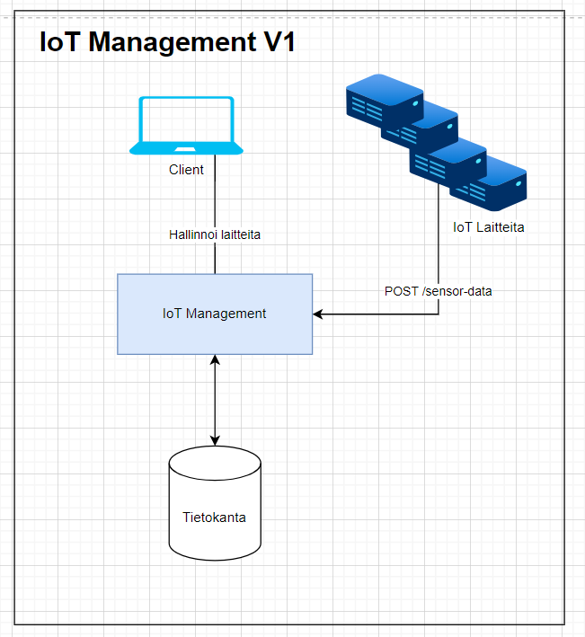
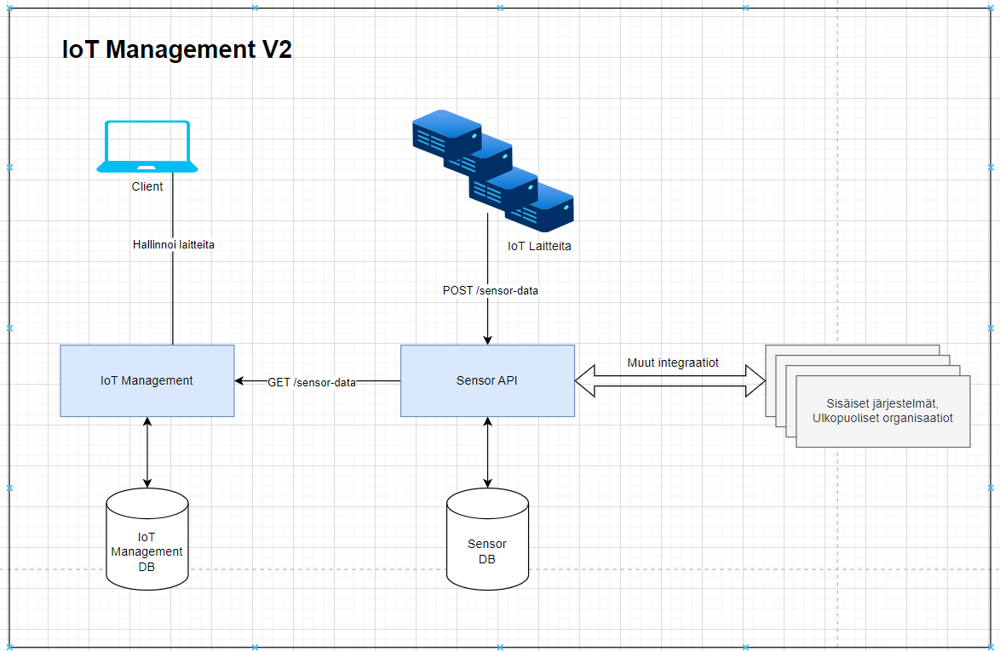

# IoT Management - V2

- Shows how using OOP and clean architecture fixes the mess we have in [V1](../v1).
- Code is more maintainable, extendable and testable.
- Appropriate abstractions make it easy to migrate from [V1 Architecture](#v1-architecture) to [V2 Architecture](#v2-architecture).
- This final version changes implementation from `SQLSensorDataRepository` to `SensorAPIClient` implementation of `SensorDataRepository`.


## V1 Architecture


## V2 Architecture


## Setup
Install dependencies
```
pip install -r requirements.txt
```

## Run development server
### Iot Management
```
cd v2/iotmanagement/
python -m flask --app src.web.app:create_app run --host=127.0.0.1 --port=5065 --debug
```

### Sensor API
```
cd v2/sensorapi/
python server.py

